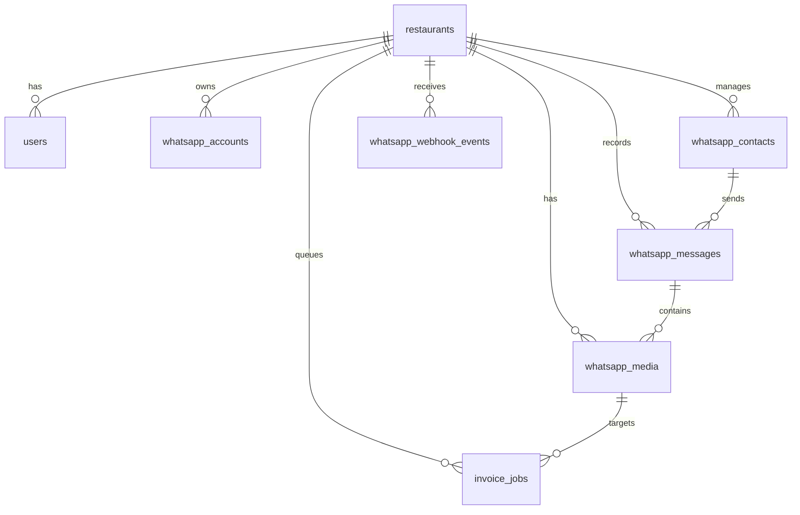

# Multi-Tenant WhatsApp Business API SaaS Integration Platform

A production-ready, async-first Python/FastAPI backend service designed for managing multi-tenant WhatsApp Business Accounts (WABA) for a SaaS platform. This backend supports registering restaurant owners, connecting WABA accounts through Meta Embedded Signup, processing incoming webhook events dynamically, logging contact and message threads under tenant isolation, downloading media attachments asynchronously using Celery and Redis, and flagging attachments for invoice processing jobs.

---

## Technical Stack

* **Python 3.12+**
* **FastAPI** (Web framework)
* **PostgreSQL 16** (Database)
* **Redis 7** (Celery broker and result backend)
* **SQLAlchemy 2.0** (Async DB mapping & query engine)
* **Celery** (Distributed background task queue)
* **Alembic** (Database schema migrations)
* **Pydantic v2** (Settings configuration & schema serialization)
* **HTTPX** (Asynchronous HTTP requests)
* **Cryptography (Fernet)** (AES-256 access token encryption at rest)
* **Docker & Docker Compose** (Containerized orchestration)

---

## Multi-Tenant Directory Layout

```text
app/
├── api/                  # REST APIs (Tenant Scoped)
│   ├── auth.py           # Register and retrieve JWT tokens
│   ├── whatsapp.py       # Connect WABA accounts and encrypt tokens
│   └── endpoints.py      # CRUD for Messages, Media, Contacts, Invoice Jobs
├── auth/                 # Authentication rules & RBAC dependencies
│   ├── __init__.py
│   └── dependencies.py   # JWT decoding & role validation (Owner/Admin)
├── config/               # Settings configuration
│   ├── __init__.py
│   └── settings.py       # Settings (JWT, Database, Redis, AES Encryption)
├── database/             # SQLAlchemy Engine & Session Configuration
│   ├── __init__.py
│   ├── base.py
│   └── session.py        # Async Session generator (get_db)
├── middleware/           # HTTP Middleware templates
│   └── __init__.py
├── models/               # SQLAlchemy 2.0 ORM Models
│   ├── __init__.py
│   └── models.py         # 8 Relational multi-tenant SaaS tables
├── repositories/         # Scoped Data Access layers
│   ├── __init__.py
│   ├── user_repo.py
│   ├── restaurant_repo.py
│   ├── whatsapp_account_repo.py
│   ├── contact_repo.py
│   ├── message_repo.py
│   ├── media_repo.py
│   ├── webhook_event_repo.py
│   └── invoice_job_repo.py
├── schemas/              # Request / Response Schemas
│   ├── __init__.py
│   └── schemas.py
├── services/             # Core business services
│   ├── __init__.py
│   ├── media_service.py  # Attachment downloader called by Celery workers
│   ├── whatsapp_client.py# Meta Graph API client (dynamic tokens)
│   └── whatsapp_service.py# Webhook payload parser and tenant resolver
├── workers/              # Celery background workers
│   ├── __init__.py
│   └── celery_worker.py  # Celery application and task definitions
└── main.py               # FastAPI entrypoint and router registration
```

---

## Tenant Isolation & Security Architecture

1. **Role-Based Access Control (RBAC)**:
   * **Super Admin**: Access to system-wide resources (e.g. view all restaurants and users).
   * **Restaurant Owner**: Access restricted exclusively to records matching their user `restaurant_id`.

2. **Database Tenant Isolation**:
   * Repository classes accept a `restaurant_id` in their constructor. If set, every database read, update, or delete is forced to append a `.filter(Model.restaurant_id == restaurant_id)` constraint.

3. **Storage Tenant Isolation**:
   * Downloader worker stores media files under distinct subfolders grouped by tenant:
     `/app/storage/media/{restaurant_id}/{media_id}.ext`
   * Serving files via the `GET /api/media/{restaurant_id}/{filename}` endpoint verifies that the authenticated user is a Super Admin or owns that specific `restaurant_id` before loading the file.

4. **Credential Hashing & Token Encryption**:
   * Passwords are encrypted using **bcrypt** via `passlib`.
   * Restaurant-specific Meta API access tokens are encrypted using **AES-256 (Fernet)** cryptography before being stored in the database.

---

## Database Schema (PostgreSQL)



---

## Setup & Running Instructions

### Local Prerequisites

1. **Clone the repository and enter the directory**:
   ```bash
   cd whatsapp_bot
   ```

2. **Configure environment variables**:
   Copy `.env.example` to `.env` and fill in your custom credentials:
   ```bash
   cp .env.example .env
   ```

3. **Run the stack using Docker Compose**:
   ```bash
   docker-compose up --build
   ```
   This command automatically downloads images, builds the containers, and launches:
   * **`db`**: PostgreSQL 16 server (mapping port `5432`).
   * **`redis`**: Redis 7 cache/broker (mapping port `6379`).
   * **`web`**: FastAPI backend service (mapping port `8000`).
   * **`worker`**: Celery worker daemon picking up media tasks.

---

## Step-by-Step API Integration Workflow

### 1. Register a Restaurant Owner Account
* **Endpoint**: `POST /auth/register`
* **Payload**:
  ```json
  {
    "email": "owner@tastyburger.com",
    "password": "owner_secure_password_123",
    "role": "restaurant_owner",
    "restaurant_name": "Tasty Burger HQ"
  }
  ```
  *(Creates a new Restaurant record and hashes the User password, linking them)*.

### 2. Log In to Obtain JWT Access Token
* **Endpoint**: `POST /auth/token`
* **Payload (x-www-form-urlencoded)**:
  * `username`: `owner@tastyburger.com`
  * `password`: `owner_secure_password_123`
* **Response**:
  ```json
  {
    "access_token": "eyJhbGciOiJIUzI1Ni...",
    "token_type": "bearer",
    "role": "restaurant_owner",
    "restaurant_id": 1
  }
  ```
  *(Attach this token as an `Authorization: Bearer <token>` header for subsequent requests)*.

### 3. Connect a WABA (Meta Embedded Signup Integration)
* **Endpoint**: `POST /whatsapp/connect`
* **Headers**: `Authorization: Bearer <token>`
* **Payload**:
  ```json
  {
    "waba_id": "waba_id_abc123",
    "phone_number_id": "9484607452",
    "phone_number": "+15555555555",
    "access_token": "EAAObc123...",
    "meta_business_id": "biz_id_999"
  }
  ```
  *(Generates an encrypted string of the access token, inserts WABA properties, and sets status to connected)*.

---

## Webhook Ingestion & Invoices Detection

1. **Meta Webhook Setup**:
   * Configure the webhook URL to point to `https://yourdomain.com/webhooks/whatsapp`.
   * Set your custom **Verify Token** (e.g. `your_custom_webhook_verification_token`).
   * When registering, Meta validates the URL via GET challenge. Once verified, webhook POST payloads will flow.

2. **Signature Validation**:
   * Incoming POST requests are validated using the `WHATSAPP_APP_SECRET` key to check the `X-Hub-Signature-256` header.

3. **Background Media Download & Invoice Jobs**:
   * If an incoming message contains an image or document attachment:
     1. Webhook parses it, saves metadata in DB, and returns `200 OK` instantly to Meta.
     2. A background Celery download job is queued: `download_media_task.delay(media_record_id)`.
     3. Worker pulls WABA credentials, decrypts the token, queries Meta CDN, and streams download chunks to local storage.
     4. Performs **Invoice Detection rules**: If MIME type is PDF or the filename contains "invoice" (case insensitive), it automatically creates a new `InvoiceJob` in the `pending` state.
